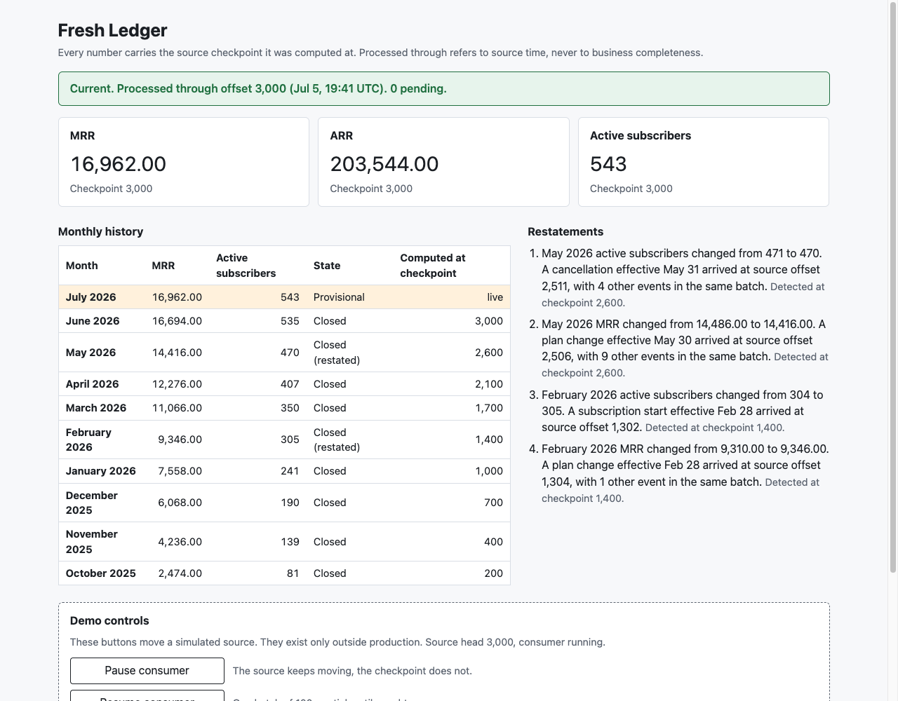
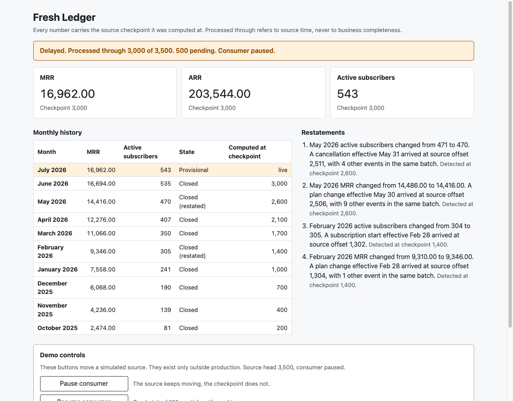
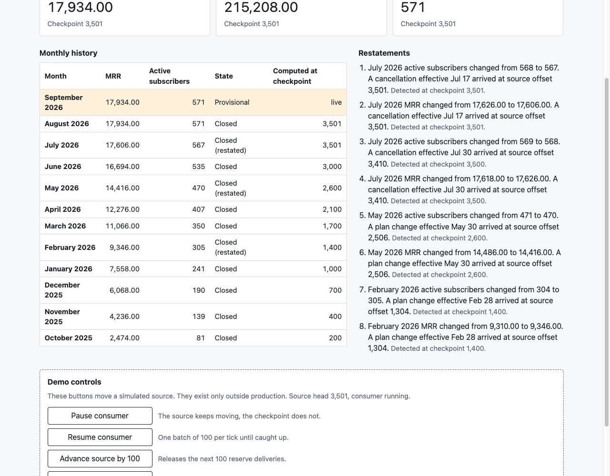
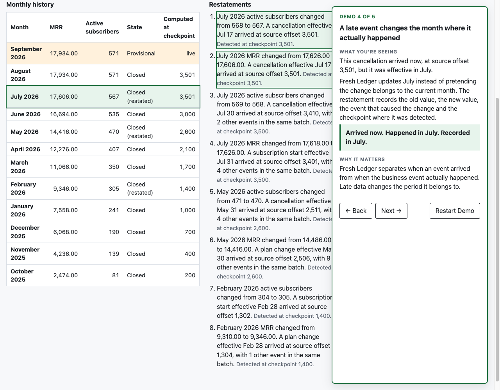
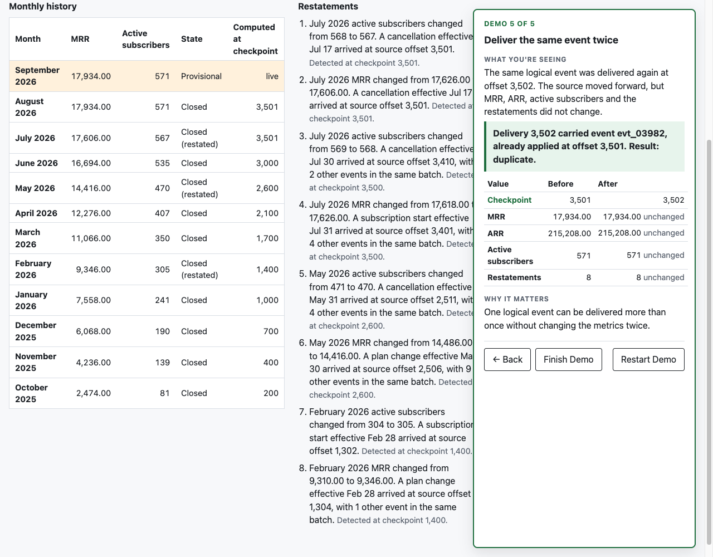

# Fresh Ledger

A number can be arithmetically correct for the events processed so far and still be misleading if the system presents it as current. Fresh Ledger treats the value and its provenance as one object: MRR is never shown without the exact source checkpoint it was computed at, the dashboard says Delayed when the source has moved past that checkpoint, and events that arrive late in source time but belong to an earlier business period restate that period as an explicit, explained correction.

Three questions, three answers:

1. Source order answers "how far have we processed?"
2. Effective time answers "when did this actually happen?"
3. The metric snapshot answers "what did we know, and what did we show, at this exact checkpoint?"

Six guarantees, each owned by a test (see the invariants table):

1. A logical event has at most one domain effect, however many times the source delivers it.
2. Metric values and their checkpoint come from one snapshot row; the live source head is observed separately, so freshness can only deteriorate between snapshots.
3. The checkpoint never claims work beyond what was durably applied or durably classified.
4. Late events affect the business period they belong to, never the period they arrived in.
5. Historical changes are surfaced as explicit restatements with cause and checkpoint.
6. Current MRR reconciles exactly to per-subscriber contributions, in SQL.

Stack: an npm workspace with a Hono server over `pg` and raw SQL (no ORM), a Vite React 19 dashboard, a shared types package, PostgreSQL 16 in Docker, Vitest against the real database, and CI from the first commit. Built in a day as a prototype; the limits are listed at the end.

## Demo



Fresh database, consumer running. Every card carries the checkpoint it was computed at, and the banner says how far the consumer has processed in source time.



The consumer is paused and the source has moved 500 deliveries ahead. Values do not change, and the banner says Delayed with the pending count instead of pretending.



A cancellation effective in July arrives at source offset 3,501 on September 28. The consumer stays Current, July is restated with the cause and the checkpoint that detected it, August closes for the first time already including it, and September is provisional.





### Guided demo

Press "Start Guided Demo" in the dashboard header. It resets the database to the fixture, drains the consumer to checkpoint 3,000 and opens a five-step panel on the real dashboard. Each step says what is on the screen, why it matters, and carries one button that runs the real demo action: pause and release the reserve, catch up, inject the late cancellation, replay the duplicate. Every restart produces the same checkpoints, values, backlog, restatements and duplicate result, so it can be rehearsed and recorded without the terminal. The step lives in the URL hash, so a reload keeps the place.

1. Every number tells you how fresh it is: Current at 3,000, 0 pending. "Simulate source moving ahead" pauses the consumer and releases the whole reserve.
2. The source moves, but the dashboard does not pretend: Delayed, 3,000 of 3,500, 500 pending, cards unchanged. "Catch up" resumes.
3. Watch the checkpoint catch up: the banner counts 3,100, 3,200 and so on until Current again. "Inject a late cancellation" releases offset 3,501.
4. A late event changes the month where it actually happened: still Current at 3,501, July restated. "Show history" highlights the July row and its two sentences under one line: arrived now, happened in July, recorded in July.
5. Deliver the same event twice: "Replay duplicate event" moves the checkpoint to 3,502 and nothing else moves. The panel proves it with the delivery ledger row for 3,502 (the same event id, classified duplicate, first applied at 3,501) and a before and after table of checkpoint, MRR, ARR, active subscribers and restatement count. "Finish Demo" ends on a four-point summary.

The manual script, for the same beats with the plain demo controls:

1. Fresh database, consumer running. The dashboard reads Current, processed through offset 3,000, 0 pending. Every number carries the checkpoint it was computed at.
2. Pause the consumer, then advance the source five times, which releases the whole reserve. The banner reads Delayed, processed through 3,000 of 3,500, 500 pending, and the values are unchanged. The source moved, we did not, and the dashboard says so.
3. Resume. The checkpoint climbs by 100 per second, values change, pending reaches 0, Current again. The reserve carries ordinary late events of its own, so a few restatements detected at checkpoints up to 3,500 appear during this beat.
4. Inject the late cancellation, which releases offset 3,501 alone. The consumer stays Current after one more batch of one delivery. The restatements list gains exactly two sentences for July 2026 (MRR and active subscribers) detected at checkpoint 3,501, the July row carries the restated marker, August closes for the first time already including the cancellation, and September is provisional. It arrived now, it happened in July, and it is recorded in July.
5. Replay the duplicate. The checkpoint advances by one, no value moves, no restatement appears. One logical event, two deliveries, one effect.
6. End on the invariants table below.

The fixture's own history contains ordinary late events too (a cancellation effective July 30 received on August 1, for example), so the restatements list already has entries before the seeded one is injected. That is the point: restatements are a normal part of the model, not an exception path.

## How it works

### Two kinds of time

Every delivery carries two timestamps. `source_received_at` is when the source handed it over; it is non-decreasing with the source offset and it is the only thing "processed through" ever refers to. `effective_at` is when the business fact happened. Ingestion is ordered by source offset. Subscriber state is never derived from source order: it is the fold of that subscriber's events ordered by `(effective_at, first_source_offset)`. A late event is one whose `effective_at` falls in a month that was already closed when it arrived. A delayed consumer is one whose checkpoint is behind the source head. Late is a business-time property, delayed is a consumer property, and they are independent.

### Source delivery versus logical event

`source_deliveries` is the stream: one row per offset, unique and contiguous, with a terminal `result` of `applied`, `duplicate` or `conflict` once processed (`pending` before). `events` is the ledger of business facts: one row per `event_id`, unique, holding only the fact and the offset it first arrived at, never derived state. A redelivery of a known `event_id` is classified `duplicate` by the unique index, advances the checkpoint, and has no second effect.

### The fold and semantic conflicts

`fold(events)` in `server/src/domain/fold.ts` is a pure function: `started` on an inactive subscriber activates it with the plan's MRR; `plan_changed` on an active subscriber switches the plan; `cancelled` deactivates; `cancelled` on an inactive subscriber is a kept no-op. `started` while active and `plan_changed` while inactive are semantic conflicts: the event is kept in the ledger, recorded in `event_conflicts`, excluded from the fold, counted in the API, and the checkpoint advances past it. The same rules live in SQL (`server/sql/subscriber_states.sql`), and a test proves the two agree for every subscriber in the fixture. A late event can change the classification of an earlier one (a late `started` can turn an orphan `plan_changed` into a valid one); the consumer re-folds every affected subscriber and writes the new classification back to the delivery rows, so the ledger, the projections and the snapshot count never disagree.

### The batch transaction

The consumer ticks every second unless paused and processes the next contiguous batch of up to 100 deliveries after the checkpoint in one transaction:

```
BEGIN
  lock source_state
  deliveries = offsets checkpoint+1 .. min(checkpoint+100, head), in order
  insert each event; the unique index decides applied versus duplicate
  re-fold every affected subscriber, upsert its projection, record conflicts
  sync delivery results with the fold for those subscribers
  recompute closed months from the earliest touched month to the last closed month (SQL)
  insert one restatement per changed month and metric, with cause and checkpoint
  compute current MRR, ARR and active subscribers with SUM over projections (SQL)
  insert one metric_snapshot at the batch's last offset
COMMIT
```

A crash before commit leaves nothing: the checkpoint is unchanged and the batch reruns. A crash after commit leaves everything in place and the next tick starts after the new checkpoint. The unique index on `metric_snapshots.checkpoint_offset` makes it impossible for two workers to commit the same batch; a test holds that index open from a second connection and proves the whole batch rolls back. A batch with a gap in its offsets is refused rather than skipped, so the checkpoint never covers an offset that was not processed.

### Closed versus provisional months

A month is closed when it is strictly before the month of the checkpoint delivery's `source_received_at`. The month containing the checkpoint is provisional and is served from the latest snapshot, so its value and its checkpoint are the ones shown on the cards. Closed months are recomputed in SQL and stored in `monthly_metrics` with the checkpoint they were computed at. Only closed months can be restated.

### Restatements

When a recompute changes a closed month's MRR or active subscriber count, the consumer writes a `restatements` row with the previous value, the new value, a cause and the checkpoint that detected it. The cause is chosen per metric from the batch's applied, non-conflict events: only events that can move that metric in the direction it moved (a plan change cannot change the active count, a cancellation cannot raise it), preferring events effective inside the month over earlier ones whose state carries into it, earliest first. When more than one candidate touches the month, the row keeps the count and the sentence says so, because one event is rarely the whole story. The API renders each row as a deterministic sentence: "July 2026 MRR changed from 17,626.00 to 17,606.00. A cancellation effective Jul 17 arrived at source offset 3,501." or, with company, "... arrived at source offset 3,410, with 2 other events in the same batch."

### The snapshot as checkpoint and the live head

There is no checkpoint table. The latest `metric_snapshots` row is the checkpoint, and it carries the values that were true at that checkpoint. `/api/metrics/current` reads that one row, then reads `source_state.head_offset` live, and reports `pending = head - checkpoint`. The status is `current` only when pending is 0, `delayed` when the head is ahead, and `unavailable` only when the source state cannot be read. Values and checkpoint can never come from different rows, and a test inserts a newer snapshot between the row read and the response to prove it.

## The two SQL queries

### Month-end reconstruction (`server/sql/monthly_metrics.sql`)

For each month in the range, take every subscriber's last non-conflict event by business time before the month's end, join the plan, and sum. `generate_series` produces the months, a lateral `DISTINCT ON` picks the deciding event per subscriber per month, and the sum rounds per row to `NUMERIC(18,6)`.

```sql
WITH months AS (
  SELECT to_char(m AT TIME ZONE 'UTC', 'YYYY-MM') AS period, (m + interval '1 month') AS period_end
  FROM generate_series($1::timestamptz, $2::timestamptz, interval '1 month') AS m
),
state_at_month_end AS (
  SELECT
    mo.period,
    s.subscriber_id,
    s.type,
    s.plan_id
  FROM months mo
  CROSS JOIN LATERAL (
    SELECT DISTINCT ON (e.subscriber_id) e.subscriber_id, e.type, e.plan_id
    FROM events e
    LEFT JOIN event_conflicts c ON c.event_id = e.event_id
    WHERE c.event_id IS NULL AND e.effective_at < mo.period_end
    ORDER BY e.subscriber_id, e.effective_at DESC, e.first_source_offset DESC
  ) s
)
SELECT
  mo.period,
  coalesce(sum(
    CASE
      WHEN sme.type = 'subscription.cancelled' THEN 0::numeric(18, 6)
      WHEN p.cadence = 'annual' THEN (p.price_cents::numeric / 100 / 12)::numeric(18, 6)
      ELSE (p.price_cents::numeric / 100)::numeric(18, 6)
    END
  ), 0)::numeric(18, 6) AS mrr,
  count(*) FILTER (WHERE sme.type <> 'subscription.cancelled')::int AS active_subscribers
FROM months mo
LEFT JOIN state_at_month_end sme ON sme.period = mo.period
LEFT JOIN plans p ON p.id = sme.plan_id
GROUP BY mo.period
ORDER BY mo.period
```

Why SQL and not a loop: the question "what was each subscriber's state at the end of each month" is a per-group ordering problem, and `DISTINCT ON` with an `ORDER BY` is the direct statement of it. The database does one pass over the indexed timeline per month instead of the application loading every event, and the rounding happens once, in one place, in the same numeric type that stores the money. It is also one statement a reviewer can run by hand and explain.

### Reconciliation (`server/sql/reconcile.sql`)

Three ways to compute current MRR that must agree: the latest snapshot, the sum over the projection table, and a fold straight from the events ledger (the `subscriber_states` query inlined where `__SUBSCRIBER_STATES__` appears).

```sql
WITH latest AS (
  SELECT current_mrr, active_subscribers FROM metric_snapshots ORDER BY checkpoint_offset DESC LIMIT 1
),
projected AS (
  SELECT coalesce(sum(current_mrr), 0)::numeric(18, 6) AS mrr, count(*) FILTER (WHERE status = 'active')::int AS active
  FROM subscriber_projections
),
folded AS (
  SELECT coalesce(sum(current_mrr), 0)::numeric(18, 6) AS mrr, count(*) FILTER (WHERE status = 'active')::int AS active
  FROM (__SUBSCRIBER_STATES__) states
)
SELECT
  latest.current_mrr AS snapshot_mrr,
  projected.mrr AS projected_mrr,
  folded.mrr AS folded_mrr,
  latest.active_subscribers AS snapshot_active,
  projected.active AS projected_active,
  folded.active AS folded_active,
  latest.current_mrr = projected.mrr AND projected.mrr = folded.mrr
    AND latest.active_subscribers = projected.active AND projected.active = folded.active AS reconciled
FROM latest, projected, folded
```

Why SQL and not a loop: a reconciliation is only convincing if it does not share code with the thing it checks. The projection table is written by TypeScript through the fold; the `folded` branch recomputes the same states from the ledger in SQL alone, with no application code in between. Equality is tested inside the database on `NUMERIC` values, so a floating-point drift in the application could never make the check pass by accident.

## Invariants

| Id     | Statement                                                                                                                                                                 | Owning test                                                                |
| ------ | ------------------------------------------------------------------------------------------------------------------------------------------------------------------------- | -------------------------------------------------------------------------- |
| INV-1  | Idempotent effect: the same `event_id` at two offsets yields one event, one applied and one duplicate delivery, identical projections and metrics.                        | `server/test/consumer.test.ts`, "INV-1 and INV-8"                          |
| INV-2  | Reconciliation: for every snapshot, `current_mrr` equals the sum over projections and the fold recomputed from events, in SQL.                                            | `server/test/consumer.test.ts`, "INV-2 and INV-3"                          |
| INV-3  | ARR derivation: `current_arr = current_mrr * 12` for every snapshot, in SQL.                                                                                              | `server/test/consumer.test.ts`, "INV-2 and INV-3"                          |
| INV-4  | Checkpoint monotonic and bounded: each snapshot's checkpoint is greater than the previous and never above the head.                                                       | `server/test/consumer.test.ts`, "INV-4"                                    |
| INV-5  | No torn reads: values and checkpoint come from one snapshot row even when a newer snapshot lands mid-request; `pending = head - checkpoint`.                              | `server/test/api.test.ts`, "INV-5"                                         |
| INV-6  | Fold determinism: any input order gives the same state; rebuilding every projection from the ledger reproduces the same rows, and SQL agrees with the fold.               | `server/test/fold.test.ts` and `server/test/projections.test.ts`, "INV-6"  |
| INV-7  | Late-event restatement: the seeded late cancellation restates the closed month it belongs to with cause and checkpoint, and no other month; causes are chosen per metric. | `server/test/consumer.test.ts`, "INV-7 and INV-9"                          |
| INV-8  | Duplicate does not restate: redelivering the late cancellation creates no event, no restatement, no projection change, and advances the checkpoint.                       | `server/test/consumer.test.ts`, "INV-1 and INV-8"                          |
| INV-9  | Late is not delayed: after the late cancellation the API is `current`, the closed month is marked restated and the provisional month reflects it.                         | `server/test/api.test.ts`, "INV-9"                                         |
| INV-10 | Delayed honesty: paused with the head advanced, the API never says `current`, values are unchanged, pending grows; the banner renders Delayed with the count.             | `server/test/api.test.ts` and `web/src/FreshnessBanner.test.tsx`, "INV-10" |
| INV-11 | Decimal correctness: an annual price that does not divide evenly (10,001 cents) still reconciles exactly in SQL.                                                          | `server/test/projections.test.ts`, "INV-11"                                |
| INV-12 | Conflict containment: a semantic conflict is classified, excluded from the fold, counted, and the checkpoint advances past it.                                            | `server/test/fold.test.ts` and `server/test/consumer.test.ts`, "INV-12"    |

Server tests run against a real PostgreSQL. The generated fixture is seeded (`SEED=20260928`) and regenerates byte-identical; a test checks the committed file against a fresh generation.

## Running it

```sh
docker compose up -d
npm install
npm run reset
npm run dev
```

`npm run reset` migrates and loads the fixture with the source head at 3,000. `npm run dev` starts the API with the consumer tick on port 3002 and the dashboard on http://localhost:5174. `npm run ci` runs lint, format check, types, and both test suites; the server suite needs the `fresh_ledger_test` database (`createdb -h localhost -p 5433 -U fresh fresh_ledger_test` once, or let CI's service container create it). `npm run fixture` regenerates `server/fixtures/deliveries.json`; `npm run consume` drains the source once without the API.

The fixture: 800 subscribers, four plans, business time from October 2025 to September 2026. Offsets 1 to 3,000 are the initial load, 3,001 to 3,500 the reserve released by the Advance control, 3,501 the seeded late cancellation (effective July 17, received September 28), 3,502 a redelivery of that same event, and 3,503 a seeded conflict used only by tests. The generator sorts by receipt time and trims, so the initial head sits in early July 2026 and the demo starts with nine closed months.

## What it does not do

- No refunds and no revenue metrics. MRR here is a run-rate; refunds are a revenue concern and were left out entirely.
- No multi-currency, taxes, proration, trials, pauses or grace periods. One account, no authentication.
- The closed-month rule (strictly before the checkpoint delivery's receipt month) and the batch size of 100 are choices, not findings.
- "Processed through" is source time. It never claims that business data is complete through any date; a late event can always arrive.
- The event vocabulary, the offset model, the conflict rule and the restatement cause rule are prototype choices. Nothing here claims to match any provider's semantics.
- `event_conflicts` is a small extra table beside the ledger so that the SQL fold and the TypeScript fold can exclude the same events; it is derived and rebuilt on every re-fold.
- It is a prototype: one consumer, one process, no partitioning, no streaming infrastructure.

## What I would measure in production

- Snapshot lag distribution: `now() - checkpoint_source_received_at` per snapshot, and the time from source head to checkpoint.
- Restatement rate per month, split by cause type, to see how late the source really is.
- Conflict rate, because a rising rate means the source's ordering assumptions broke.
- Batch duration against batch size, to know when the recompute window needs to shrink.
